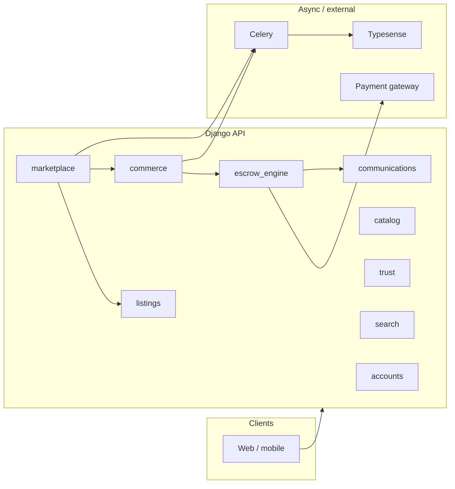

# SmartDalali backend — developer guide

This document explains how the Django backend is organized, what each **local** app is responsible for, and how they connect.
---

## 1. Big picture

The backend is a **Django 5** project with **Django REST Framework**, **Channels/Daphne** (ASGI), **Celery** for async work, and **PostgreSQL**. Marketplace flows center on:

- **Catalog + listings** — what is sold and how it is categorized.
- **Marketplace** — seller/storefront layer and product-facing subtype of a listing.
- **Commerce** — cart, orders, stock reservations, delivery — **not** the ledger for money.
- **Escrow engine** — payments, holds, releases, refunds, disputes, payouts, gateway webhooks.
- **Core** — shared primitives (base models, correlation IDs, optional outbox, **event bus** facade).

Financial correctness lives in **synchronous services** in `commerce` and `escrow_engine`. A Celery-backed **event layer** (`core.events` → `core.tasks.dispatch_event_task` → `core.event_handlers`) is only for **side effects** (logging, scoped reconciliation triggers, future notifications/analytics). See [`Bus.md`](./Bus.md) for the rules.

---

## 2. URL map (HTTP)

Root routing is in `backend/urls.py`. Main API prefixes:

| Prefix | App | Role |
|--------|-----|------|
| `/api/v1/` | — | API root JSON |
| `/api/v1/accounts/` | `accounts` | Auth-adjacent profile, addresses, OTP, etc. |
| `/api/v1/communications/` | `communications` | Messaging / conversations |
| `/api/v1/insights/` | `insights` | Metrics, seller stats hooks |
| `/api/v1/features/` | `features` | Feature flags / plans / subscriptions |
| `/api/v1/shortlinks/` | `shortlinks` | Short link CRUD |
| `/s/<code>/` | `shortlinks` | Public redirect |
| `/api/v1/marketplace/` | `marketplace` | Marketplace products, sellers, stores |
| `/api/v1/sellers/` | `sellers` | Seller onboarding, payout accounts, admin seller APIs |
| `/api/v1/listings/` | `listings` | Listing CRUD, media, likes, views |
| `/api/v1/catalog/` | `catalog` | Categories and dynamic `CategoryField` specs |
| `/api/v1/commerce/` | `commerce` | Cart, checkout, orders, wishlist, buyer/seller order APIs |
| `/api/v1/trust/` | `trust` | Verification, reviews, reputation, price anomalies |
| `/api/v1/core/` | `core` | Site config, shared utilities exposed over HTTP |
| `/api/v1/analytics/` | `analytics` | Seller/platform analytics aggregates |
| `/api/v1/escrow/` | `escrow_engine` | Escrow-facing HTTP (plus internal/provider flows) |
| `/api/v1/transactions/` | `escrow_engine.api` | Transaction API namespace |
| `/api/v1/search/` | `search` | Typesense-backed marketplace search |

Operational: `/health/`, `/health/ready/`, `/api/schema/`, `/api/docs/redoc/`, `admin/`, optional `__debug__/` and `silk/`.

---

## 3. Installed local apps (order in `settings.py`)

These appear under **Local apps** in `backend/settings.py`:

`core`, `accounts`, `communications`, `insights`, `features`, `shortlinks`, `marketplace`, `sellers`, `listings`, `catalog`, `media_app`, `commerce`, `trust`, `search`, `analytics`, `escrow_engine`

---

## 4. App-by-app reference

### `core`

**Purpose:** Shared foundations and cross-cutting behavior.

- **`core.models.base`**: `BaseModel` (timestamps), `BaseListing` (owner, store, `catalog.Category`, price, stock, specs JSON, publishing flags, etc.). Concrete listings inherit from `BaseListing` in the `listings` app.
- **`core.models.outbox`**: `OutboxEvent` — durable outbox pattern support for events (see `core/events.py`).
- **`core.models.settings`**: `SiteConfiguration` — tunable site-wide settings (referenced from **`commerce`** checkout / commission fallback in `commerce.services.checkout`).
- **`core.correlation` + `core.middleware.correlation`**: Request **correlation IDs** for tracing (used with audit/reconciliation flows).
- **`core.events`**: `emit_event(name, payload)` — logs, normalizes JSON-safe payloads, enqueues Celery; failures against the broker are swallowed so HTTP paths keep working.
- **`core.event_handlers`**: Worker-side router; many handlers are placeholders or trigger **scoped reconciliation** (`commerce.services.reconciliation`) — not primary business logic.
- **`core.domain_guard`**: Cross-domain checks (e.g. references `commerce.Order` where needed).
- **`core.tasks`**: `dispatch_event_task` and related workers.
- **`core.urls` / views**: Small API surface for operational or shared endpoints.

**Integrates with:** `commerce`, `marketplace` (via settings), `escrow_engine` (payout events), everything that emits events.

---

### `accounts`

**Purpose:** User profile and identity-adjacent data (extends Django `User`).

- **`Profile`**: One-to-one with `User` (phone, address snippet, image, notification prefs, Firebase UID, soft-delete flag). Auto-created on user save via signal.
- **`UserAddress`**: Multiple labeled addresses per user.
- **`OTP`**: Email verification / password reset / action confirmation codes.

**Integrates with:** Django auth, all apps that use `settings.AUTH_USER_MODEL`.

---

### `catalog`

**Purpose:** **Canonical** hierarchical **categories** for listings.

- **`Category`**: Tree (`parent`), `vertical` (electronics, fashion, …), `is_service` / `is_physical`, ordering.
- **`CategoryField`**: Dynamic attribute definitions per category (types, options, validation).
- Additional models in the same file support spec values / templates as the catalog grows.

**Integrates with:** `listings` / `core.models.listing.BaseListing` FK `catalog.Category`; `commerce.CommissionRule` targets categories; `marketplace.MarketplaceItem.clean()` enforces **leaf-only** categories.

> **Note:** `core.models.category.Category` exists in code but is **not** wired as the listing FK; new work should use **`catalog.Category`** only.

---

### `listings`

**Purpose:** **Canonical product row** for the platform.

- **`Listing`**: Subclasses `BaseListing` — title, price, inventory, media relations, likes, views, etc. This is the **single inventory source** for marketplace products.
- **`ListingMedia`**, **`ListingLike`**, **`ListingView`**: Engagement and assets tied to `Listing`.

**Integrates with:** `catalog`, `marketplace` (inheritance), `commerce` (cart/order line items FK `listings.Listing`), `trust`, `analytics`, `communications`.

---

### `marketplace`

**Purpose:** Marketplace-specific layer on top of listings — **seller, store, and product validation**. It must **not** own checkout or call `escrow_engine` directly; order creation and escrow transaction creation live in **`commerce`**.

- **`MarketplaceItem`**: **Multi-table inheritance** child of `listings.Listing` — same primary key, extra validation (e.g. must use a **leaf** category). Comments in `marketplace/models.py` stress: stock and price are **not** duplicated; they live on the parent `Listing`.
- **`SellerProfile`**, **`Store`**, storefront fields: seller identity and shopfront; verification state is coordinated via **`marketplace.services.seller_service.SellerService`** (state machine rules: only **`verified`** sellers are buyer-active; see code).
- **`marketplace/services/`** (package):
  - **`seller_service`**: verification transitions, document upload validation, review stats, store follow toggles.
  - **`store_service`**: default store creation, slug uniqueness, syncing store visibility with seller verification, store statistics.
  - **`marketplace_service`**: attribute/spec helpers, **`PriceAnomalyService`**, relational product attribute persistence.
- **`marketplace.signals`**: On product save, queues **`sync_product_to_typesense`** (`marketplace.tasks` → `search.typesense_client`).

**Integrates with:** `listings`, `commerce` (conceptually: checkout is invoked from commerce views/services only), `trust`, `core` (events where emitted from downstream flows), `search` (index sync).

---

### `sellers`

**Purpose:** Seller **onboarding and payout setup** complementary to `marketplace.SellerProfile`.

- **`SellerIDVerification`**, **`SellerBusinessVerification`**, **`SellerOnboardingProgress`**: Step tracking and document flows.
- **`SellerPayoutAccount`**: Destination accounts for disbursement (channel types aligned with `escrow_engine` Selcom channels).

**Integrates with:** `marketplace.SellerProfile`, `escrow_engine` payout types.

---

### `commerce`

**Purpose:** **Commercial workflow** without owning the financial ledger.

- **Models:** `Cart` / `CartItem`, `Wishlist` / `WishlistItem`, `Order` / `OrderItem`, `StockReservation`, `Delivery`, `CommissionRule`, `OrderAuditLog`, etc. Orders link buyer, seller, listings, amounts; **status transitions** must go through **`OrderLifecycleManager`** (bulk `QuerySet.update` on `Order.status` is blocked).
- **Key services:**
  - **`commerce.services.inventory.InventoryService`** — stock reservations against `StockReservation` / listing `reserve_stock` (used at checkout and by periodic cleanup).
  - **`commerce.services.checkout.OrderService`** — **`create_order_from_cart`**, **`calculate_platform_fee`**, escrow **`create_transaction`** linkage, order emails / Celery scheduling (side effects only via `emit_event` for `ORDER_CREATED`).
- **Views:** Cart, checkout, order APIs; integration with **`escrow_engine`** for `initiate_payment`, payouts, disputes (engine models re-exported in views where needed).
- **`commerce.services.reconciliation`**: Compares order/escrow/payout state; can emit **`core.events`** for anomalies; triggered from event handlers after certain lifecycle events.
- **`commerce.signals`**: Notifications via `communications.notification_service`.
- **`commerce.tasks`**: Order emails, auto-cancel, inventory cleanup; uses `escrow_engine.services.linked_order` and `OrderLifecycleManager`.

**Integrates with:** `listings`, `marketplace` (seller/store visibility rules affect what buyers see; no order logic in marketplace), `escrow_engine`, `communications`, `trust`, `core.events`.

---

### `escrow_engine`

**Purpose:** **Money movement and payment state** — the system of record for transactions.

- **Models** (see `escrow_engine/models/__init__.py`): `Transaction`, `TransactionLog`, `Payout`, `PayoutDestination`, `Dispute`, `DisputeEvidence`, `PaymentRecord`, `PaymentLink`, `GatewayEvent`, `APIKey`, enums / state machine types.
- **Services:** `payment` (initiate, confirm, webhooks), `escrow` (hold/release/refund), `payout` (seller payouts), retries, metrics, distributed locks.
- **`escrow_engine.integrations.commerce_sync`**: Thin facade calling **`commerce.services.order_escrow_sync`** so the dependency direction stays explicit: engine → commerce sync, not deep imports scattered everywhere.
- **API:** `escrow_engine/urls.py`, `escrow_engine/api/urls.py`, webhook endpoints, API key auth for selected routes.

**Integrates with:** Payment providers (e.g. Selcom in `escrow_engine/providers`), `commerce` (order linkage), `communications.tasks` (generic notifications on some escrow paths), `core.events` from payout/release paths.

---

### `trust`

**Purpose:** **Trust and safety** — verification, reviews, reputation, fraud-ish signals.

- **`UserVerification`**, **`ListingVerification`**, **`ReputationScore`**, **`PriceAnomaly`**, **`Review`**, and related models support moderation and scoring.
- **`trust.services`**: e.g. `update_seller_rating` called from **`marketplace.services.seller_service.SellerService`** (and from commerce/trust flows where reviews complete).

**Integrates with:** `accounts`/`auth.User`, `listings` (by id + content types where generic), `marketplace`, `commerce` (order lifecycle).

---

### `search`

**Purpose:** **Typesense**-backed full-text search for marketplace products.

- **`search/views.MarketplaceSearchView`**: HTTP search; requires `TYPESENSE_API_KEY` and collection config from settings.
- **`search.typesense_client`**: Client bootstrap and collection ensure.

**Integrates with:** **`marketplace.tasks.sync_product_to_typesense`** (write path). No Django `search` models of note (ORM models file is essentially empty).

---

### `communications`

**Purpose:** **Buyer–seller messaging** and notification plumbing.

- **`Conversation`**: Links two users; optional FK to `commerce.Order`, `listings.Listing`, or `escrow_engine.Dispute`.
- **`Message`**: Content, attachments (Cloudinary), delivery/read states.
- **`communications.tasks`**: e.g. `send_generic_notification_task` used from escrow release/refund flows.
- **`notification_service`**: Used from `commerce.signals` and elsewhere.

**Integrates with:** `commerce`, `escrow_engine`, `listings`.

---

### `analytics`

**Purpose:** **Aggregated metrics** (seller and platform).

- **`SellerStats`**, **`PlatformMetrics`**, **`AgentStats`**: Rollups with methods like `calculate_stats()` that query `listings`, `commerce.Order`, `trust.Review`, etc.

**Integrates with:** `listings`, `commerce`, `trust`, `auth.User`.

---

### `insights`

**Purpose:** **Product/analytics insights** endpoints and lighter-weight tracking models.

- Models such as **`DailyMetric`**, **`Visitor`**, **`Event`** (behavioral event stream with session/user metadata).
- URLs wired from root `urls.py` (e.g. seller stats summary import).

**Integrates with:** Frontend reporting; overlaps conceptually with `analytics` (docstrings in `insights` point to `analytics.PlatformMetrics` for platform rollups).

---

### `features`

**Purpose:** **Subscription and feature-gating** data model.

- **`Feature`**, **`Plan`**, **`PlanFeature`**, **`Subscription`**, plus legacy **`SubscriptionPlan`** for backward compatibility.

**Integrates with:** `auth.User`; designed for plan-based product behavior (orthogonal to per-order escrow).

---

### `shortlinks`

**Purpose:** **Short URLs** for marketing or deep links.

- **`ShortLink`**: `code` → `target_url`, visit counts.
- Public redirect: `/s/<code>/`.

**Integrates with:** Minimal; standalone.

---

### `media_app`

**Purpose:** **Generic media** attachments via **ContentTypes** (`content_type` + `object_id`).

- **`Media`**: File, type, ordering, “main image” flag; upload path can infer vertical from related object.

**Integrates with:** Any model exposed through contenttypes (listings and other entities can attach media here vs `listings.ListingMedia` — know which path your feature uses).

---

## 5. Critical domain rules (read before changing checkout or payments)

1. **One listing row:** `MarketplaceItem` **is-a** `Listing` (multi-table inheritance). Inventory mutations go through **`commerce.services.inventory.InventoryService`** and listing `reserve_stock` / `release_stock` patterns — not ad hoc decrements.
2. **Order status:** Use **`commerce.services.lifecycle.OrderLifecycleManager`**, not bulk updates on `Order.status`.
3. **Money:** **`escrow_engine`** owns transaction state; **`commerce`** owns order/cart/delivery. Sync from escrow into commerce goes through **`commerce.services.order_escrow_sync`**, called via **`escrow_engine.integrations.commerce_sync`**.
4. **Events:** `emit_event` is for **side effects** only; do not rely on Celery for financial correctness. Details: [`Bus.md`](./Bus.md).
5. **Search index:** Listing/product changes for marketplace should trigger Typesense sync via **`marketplace.tasks.sync_product_to_typesense`** (already hooked from marketplace signals for `MarketplaceItem`).

---

## 6. Async and scheduling

- **Celery** app: `backend/celery.py` — `autodiscover_tasks()` loads tasks from installed apps (`core`, `commerce`, `escrow_engine`, `marketplace`, …).
- **django-celery-beat / django-celery-results**: Installed for periodic tasks and storing task results (configure schedules in admin or migrations as your deployment does).
- **Escrow:** `escrow_engine/tasks.py` documents that timed money movement should be scheduled **from escrow**, not from commerce, to keep boundaries clear.

---

## 7. Auth and API docs

- **DRF** + **SimpleJWT** + **django-allauth** (social providers) + session/auth token support as configured in `settings.py`.
- **drf-spectacular**: OpenAPI schema at `/api/schema/`, Redoc at `/api/docs/redoc/`.
- **escrow_engine** may use **API keys** (`escrow_engine.models.APIKey`) for specific integrations — see `escrow_engine/api/authentication.py`.

---

## 8. Audit findings, known issues, and remediation

This section records **issues discovered during backend review** (architecture, security, and maintainability), what was **fixed**, and what **remains** to track. It is not a substitute for threat modeling or pen testing.

### 8.1 Fixed or materially improved (high impact)

| Area | Issue | Remediation |
|------|--------|-------------|
| **Domain boundaries** | Checkout and escrow transaction creation lived under `marketplace`, blurring ownership and encouraging `marketplace` → `escrow_engine` imports. | **`OrderService`** and **`InventoryService`** moved to **`commerce.services.checkout`** and **`commerce.services.inventory`**. Marketplace owns seller/store/product services only (`marketplace/services/` package). |
| **Security / privacy** | `SellerProfile` detail could expose sensitive fields (e.g. tax ID, verification documents) to non-owners; retrieve queryset allowed odd cases. | **Split serializers** (`SellerProfilePublicSerializer` vs owner/staff projection), stricter **`get_queryset`** on retrieve/list, document upload validation (size, extension, safe filename). |
| **Verification state** | `verification_status`, `is_verified`, and `is_active` could drift; admin bulk updates bypassed model rules. | **`SellerService`** centralizes transitions; **`SellerProfile.save`** syncs derivatives (`is_verified` / `is_active`) with safe `update_fields` merging; admin actions call services. |
| **Store slugs** | Slug loop could race or truncate awkwardly under concurrency. | **`unique_store_slug`** uses entropy + retries; **`ensure_default_store_for_seller`** handles **`IntegrityError`**. |
| **Uploads** | Unrestricted document uploads to seller verification. | Validated types/size; storage path sanitized. |
| **Performance** | Store follow checked with per-row queries; some list paths N+1-heavy. | **`Exists`** annotation for **`is_followed`** on store querysets; expanded **`prefetch_related`** on marketplace items and favorites; batched media for similar listings. |
| **Webhooks / checkout async** | Celery tasks scheduled inside DB transactions; DEBUG allowed unsigned webhooks. | Selcom: **require** `Digest` + `Timestamp` + HMAC unless **`ESCROW_WEBHOOK_INSECURE_SKIP_VERIFY`** (DEBUG + env); post-checkout email/auto-cancel on **`transaction.on_commit`**. |
| **Reconciliation** | Auto-fix could mutate escrow/commerce state implicitly. | **`RECONCILIATION_ALLOW_MUTATING_FIX`** gates fixes (**default `false`** — set `true` only when ops approves); pair with **`RECONCILIATION_AUTO_FIX`**; **`RECONCILIATION_MISMATCH`** warnings on every detected issue. |

### 8.2 Residual risks and technical debt (monitor or schedule work)

| Area | Risk | Suggested direction |
|------|------|---------------------|
| **Duplicate / legacy models** | `core.models.category.Category` still exists alongside **`catalog.Category`** (listings use catalog). | **Deprecated** in-module docstring; `seed_marketplace` / migration scripts may still import — migrate off when ready. |
| **Analytics duplication** | `insights` vs `analytics` overlap (different models, similar intent). | Consolidate reporting contracts or document a single “source of truth” per metric. |
| **Event handlers** | Many `core.event_handlers` entries are **placeholders**. | Implement or delete dead branches; keep **`emit_event`** strictly non-critical (see [`Bus.md`](./Bus.md)). |
| **Search consistency** | Typesense index is **eventually consistent** with Postgres via Celery. | Monitor task failures; consider idempotent full reindex command for recovery. |
| **Third-party / env** | Payment gateways, Redis, Celery, Cloudinary, Typesense — outages affect subsets of flows. | Runbooks, health checks, and feature flags for degradable paths (e.g. search 503 already pattern in code). |
| **Testing surface** | Hardening tests exist (`commerce.tests.test_hardening`, `marketplace.tests.test_marketplace_security`); full regression coverage is not claimed. | Expand integration tests around checkout, webhooks, and dispute/payout edge cases. |
| **Properties app** | Legacy real-estate vertical not in `INSTALLED_APPS`. | Keep excluded until explicitly revived; avoid reintroducing cross-imports. |

### 8.3 Security posture (summary)

- **Strengths:** JWT + allauth stack, escrow as system of record, order lifecycle guards, API key path for engine, upload constraints on seller docs, correlation ID middleware for tracing.
- **Gaps to verify in your deployment:** rate limits on sensitive endpoints, WAF / bot protection, secrets rotation, DB encryption at rest. **Selcom webhooks:** HMAC enforced in production; use **`ESCROW_WEBHOOK_INSECURE_SKIP_VERIFY`** only for local debugging.

---

## 9. Production readiness score

Score is a **subjective engineering assessment** (not a certification). It assumes a typical SaaS marketplace with payments and is meant for **internal prioritization**, not marketing.

**Overall: 86 / 100** — *“Production-grade with explicit domain gates, webhook HMAC, seller privacy filters, and reconciliation observability; external pen-test still recommended.”*

| Dimension | Score (/100) | Notes |
|-----------|----------------|-------|
| **Domain architecture** | 82 | Marketplace ↔ commerce ↔ escrow boundaries enforced in code paths; checkout side effects deferred with `on_commit`. |
| **Financial correctness** | 80 | Atomic checkout + inventory locks; escrow linkage in commerce; reconciliation mismatch logging + optional mutating fix behind settings. |
| **Security & privacy** | 84 | Verified **and** active seller visibility; public serializer excludes contact/tax/docs; uploads MIME/size checks; webhook signature required unless explicit insecure dev flag. |
| **Observability** | 78 | `core.logging_context`, correlation on reconciliation/events, structured webhook rejection logs. |
| **Reliability & async** | 76 | Post-order Celery after commit; `emit_event` non-blocking; broker/outbox behavior unchanged. |
| **Testing & CI** | 78 | Marketplace privacy + uploads + checkout; Selcom HTTP webhook; reconciliation mismatch tests added. |
| **Operational maturity** | 72 | Settings for webhook dev skip and reconciliation mutation gate; admin seller actions via `SellerService` only. |

**Next steps toward 90+:** external security review, broader e2e (payout/dispute), consolidate analytics vs insights, fully retire `core.Category` after script migration.

---

## 10. Suggested reading order for new developers

1. `backend/urls.py` — see what ships.
2. `core/models/listing.py` + `listings/models.py` + `marketplace/models.py` — inheritance and inventory story.
3. `marketplace/services/` — `seller_service`, `store_service`, `marketplace_service`.
4. `commerce/services/inventory.py` + `commerce/services/checkout.py` — reservations and order creation from cart.
5. `commerce/models.py` + `commerce/services/lifecycle.py` — order state.
6. `escrow_engine/models/transaction.py` + `escrow_engine/state_machine.py` + `escrow_engine/services/payment.py` / `escrow.py` / `payout.py`.
7. `escrow_engine/integrations/commerce_sync.py` + `commerce/services/order_escrow_sync.py` — boundary between money and orders.
8. `core/events.py`, `core/event_handlers.py`, [`Bus.md`](./Bus.md) — async side effects.

---

## 11. Out of scope for this guide

- **`properties`**: Excluded per project direction; not registered as an application in `INSTALLED_APPS`.
- **Frontend**, **infrastructure**, and **secrets**: Only mentioned where they touch backend settings (Typesense, Sentry, database URL, etc.).

---

*Architectural overview for maintainers. When behavior diverges from this doc, treat the code and migrations as source of truth and update this file in the same change. Revisit the production readiness score (section 9) after major releases or audits.*
