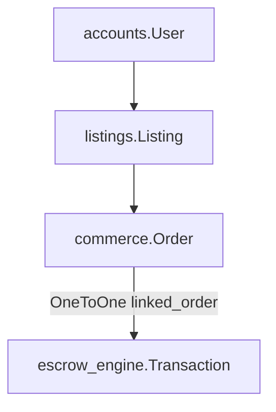
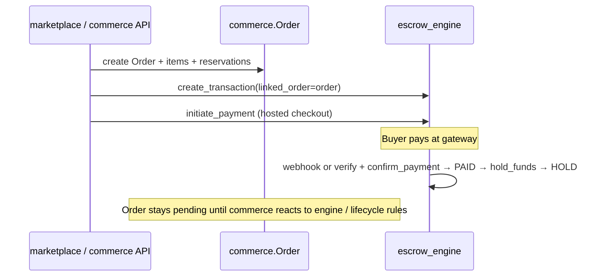
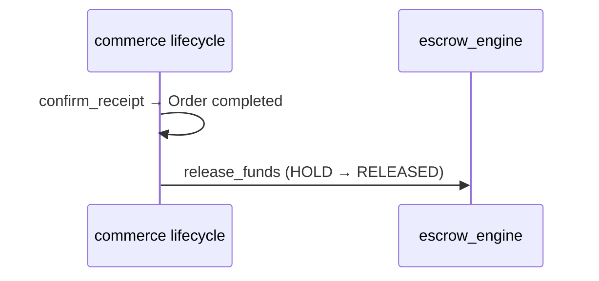
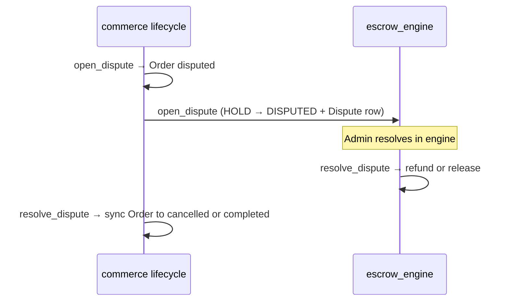

# System source of truth — marketplace domains

This document is the **authoritative map** of which Django app owns which concerns, how they connect, and which anti-patterns must stay out of the codebase.

## Domain ownership (non‑negotiable)

| Domain | Owner app | Owns | Must not own |
|--------|-----------|------|----------------|
| **Money & payments** | `escrow_engine` | `Transaction` lifecycle, payment verification/confirmation, hold/release/refund, disputes (financial resolution), payouts, payment links, gateway/webhooks | Order shipment state, cart, listing stock |
| **Orders & fulfilment** | `commerce` | `Order`, cart/wishlist, order lifecycle, `StockReservation`, delivery records, buyer/seller actions **at order level** | Authoritative payment success/failure, duplicate `payment_status` on `Order` |
| **Identity** | `accounts` | Users, auth, roles, profiles | Parallel “shadow” user records in other apps |
| **Catalog & inventory** | `listings` (+ shared `core` listing base) | Listings, base price, **real** `stock_quantity`, media | Order totals, escrow balances |
| **Seller storefront surface** | `marketplace` | Seller profile, store UX, `SellerPaymentMethod` as **seller payout preferences** | Must not declare payment *collected*; syncs preferences into `escrow_engine.PayoutDestination` |

### Link model (chain of reference)

- **One marketplace order** ↔ **at most one** engine `Transaction` for that checkout (`related_name='engine_transaction'`).

---

## Flow of control (who moves first)

### Checkout

### After payment (fulfilment)

- **Financial truth:** `escrow_engine.Transaction.status` (`PAID` → `HOLD`, etc.).
- **Operational truth:** `commerce.Order.status` (`pending` → `confirmed` / `processing` / …).
- **Commerce** may call `escrow_engine.services.escrow.hold_funds` when business rules require funds formally held alongside confirmation/shipment — that is still **engine code** invoked as a service, not commerce writing payment state directly.

### Completion

### Timed release after delivery

- **Owner:** `escrow_engine` (scheduled task), not `commerce`.
- Task: `escrow_engine.tasks.release_delivered_marketplace_escrow_periodic` — releases `HOLD` when the linked order is `delivered` and older than the configured window.

### Dispute

---

## Anti-patterns found (audit)

| Issue | Where / symptom | Risk |
|-------|------------------|------|
| **Split “paid” definition for auto-cancel** | `check_unpaid_orders_periodic` only treated `PAID` as paid; `auto_cancel_unpaid_order` treated `HOLD`/`RELEASED`/`DISPUTED` as paid enough | Duplicate cancel attempts or wrong cancels |
| **Silent dispute resolution fallback** | `OrderLifecycleManager.resolve_dispute` used `except Exception` and then `refund_funds` / `release_funds` without a `Dispute` row | Bypass engine dispute audit; double/refund edge cases |
| **Wrong escrow constant in reviews** | `commerce.services.review` compared `txn.status` to lowercase `'released'` while DB stores `RELEASED` | Reviews effectively blocked or inconsistent |
| **Commerce-owned timed money release** | Celery task lived in `commerce.tasks` | Blurred “who owns financial policy timers” |
| **Registry wording** | `ORDER_STATUS_TO_TRANSACTION_MAP` read like “commerce sets txn status” | Teaches wrong mental model |

---

## Fixes applied (this pass)

1. **`escrow_engine.services.linked_order.linked_order_has_escrow_payment_activity`** — single definition of “this order already has escrow activity” for unpaid-cancel logic (`PAID`, `HOLD`, `RELEASED`, `DISPUTED`, `REFUNDED`).
2. **`commerce.tasks`** — `auto_cancel_unpaid_order` and `check_unpaid_orders_periodic` both use that helper (aligned behavior, includes `REFUNDED`).
3. **`escrow_engine.tasks.release_delivered_marketplace_escrow_periodic`** — **delivered + 7-day** auto-release moved here; Celery Beat in `backend/settings.py` now points to this task (removed from `commerce.tasks`).
4. **`OrderLifecycleManager.resolve_dispute`** — requires linked `Transaction` and `Dispute`; always calls `escrow_engine.services.escrow.resolve_dispute` (no broad fallback).
5. **`commerce.services.review`** — uses `TransactionStatus.RELEASED` from `escrow_engine.state_machine`.
6. **`commerce.services.registry`** — documented as **expectation map**, not authority over engine status.
7. **`INSTALLED_APPS` comment** in `backend/settings.py` — commerce described without implying it owns escrow.

---

## Intentional cross-app orchestration (allowed)

These are **not** second sources of truth if they only **call** the owning service:

| Location | Role |
|----------|------|
| `marketplace.services.OrderService.create_order_from_cart` | Creates `commerce.Order`, reserves stock via listings, creates engine `Transaction`, links `linked_order`. |
| `commerce.services.payment_return.confirm_marketplace_payment_return` | HTTP return handler: **`verify_payment_with_provider`** + **`confirm_payment`** (both in `escrow_engine.services.payment`). |
| `commerce.views` `initiate_order_payment` | Thin: loads linked `Transaction`, calls `escrow_engine.services.payment.initiate_payment`. |
| `commerce.services.lifecycle.OrderLifecycleManager` | Transitions **orders** and invokes **escrow_engine** services for hold/release/refund/dispute — does not store parallel payment fields on `Order`. |
| `marketplace.signals` on `SellerPaymentMethod` | Copies payout **preferences** into `escrow_engine.PayoutDestination` (configuration sync, not payment capture). |

---

## Rules checklist for future changes

- [ ] No `payment_status` (or equivalent) on `Order` — use `order.engine_transaction.status` (via serializer/API) for money state.
- [ ] No `Transaction.transition_to` / direct status writes outside `escrow_engine` (models, services, admin except guarded ops).
- [ ] Stock mutations go through listing methods (`reserve_stock` / `release_stock`) and commerce `StockReservation`, not ad-hoc decrements on orders.
- [ ] Order `completed` for buyer receipt paths should pair with **`release_funds`** when txn is in `HOLD` (see `confirm_receipt`).
- [ ] New periodic **money** jobs belong under `escrow_engine.tasks` and are registered in Beat with namespaced task paths.

---

## Related code entry points

| Concern | Module |
|---------|--------|
| Engine payment confirmation | `escrow_engine.services.payment.confirm_payment` |
| Provider verification | `escrow_engine.services.payment.verify_payment_with_provider` |
| Hold / release / refund | `escrow_engine.services.escrow` |
| Order lifecycle | `commerce.services.lifecycle` |
| Order ↔ engine snapshot in API | `commerce.serializers` (`get_escrow`) |
| Checkout creation | `marketplace.services.OrderService` |
| Buyer contact on Transaction (checkout only) | `escrow_engine.services.payment.sync_buyer_contact_for_checkout` |
| Payment confirmation audit | `PaymentConfirmationSource` + `Transaction.metadata['payment_confirmation_source']` |
| Order status write gate | `commerce.services.order_mutations.order_status_write_context` |
| Escrow calls from commerce | `commerce.services.escrow_bridge` (`safe_*_for_order`) |
| Paranoid order↔txn checks | `commerce.services.invariants` + `ESCROW_PARANOID_MODE` |
| Domain event emission (log + async handlers) | `core.events.emit_event` → `core.tasks.dispatch_event_task` (re-export: `commerce.services.events.emit_event`) |
| Domain event handlers (side effects only) | `core.event_handlers.handle_event` (invoked by workers; no money/order state mutations) |
| Escrow → Order row sync (commerce-owned) | `commerce.services.order_escrow_sync` |
| Static invariant CI check | `python manage.py verify_commerce_invariants` |
| Order ↔ txn reconciliation | `commerce.services.reconciliation.run_reconciliation_scan` + `commerce.tasks_reconciliation` (Celery name `commerce.tasks.reconcile_orders_escrow_periodic`) |

---

## Synchronous integration (default)

Request-time and service-to-service flows use **direct Python calls** in-process:

- `marketplace.OrderService` → `commerce` models + `escrow_engine.services.*`
- `commerce.OrderLifecycleManager` → `escrow_engine.services.escrow` / `payment` (same request or task worker thread)
- No Kafka/Rabbit-style message bus is required for correctness. **`emit_event`** logs each event at INFO and **enqueues** `core.tasks.dispatch_event_task` for async side effects (notifications, analytics, future integrations). If the broker is unavailable, the log still runs and enqueue failures are swallowed so synchronous flows are unaffected. Handlers in **`core.event_handlers`** must not move financial or lifecycle logic out of process.

**Celery** is used for deferrable work (email, scheduled reconciliation, domain-event handlers, webhook offload) — not as the primary money/order command path.

---

## Control systems (enforcement layer)

- **`confirm_payment(..., confirmation_source=...)`** — Required on every path into PAID/HOLD. `PROVIDER_VERIFY` requires `raw_payload['provider_verify']` from server-side gateway verification; `WEBHOOK` requires gateway reference or payload; `ADMIN_MANUAL` / `DEV_MOCK` are explicit break-glass / dev paths. Metadata records `payment_confirmation_source` on the `Transaction`.
- **`Order.save`** — Blocks `status` changes unless `order_status_write_context(order)` (or legacy `allow_order_status_mutation()`), instance `_allow_status_transition`, or `_allow_status_mutation=True` is used.
- **`Order.objects.update(..., status=...)`** — Raises `RuntimeError` (custom `OrderQuerySet`).
- **`Order` admin** — `status` is read-only; transitions use admin actions → `OrderLifecycleManager`.
- **PATCH `/orders/{id}/`** — Cannot change `status` (except buyer cancel flow which calls `cancel_order`). Use `@action` endpoints (`ship_order`, `confirm_receipt`, …).
- **Commission** — `OrderService.calculate_platform_fee` resolves rules with `(category match OR global)` ordered by `priority`, preferring the category-specific rule when priorities tie.
- **Inventory** — `InventoryService.reserve_stock` runs inside `transaction.atomic` and locks the listing row.
- **Reconciliation** — Celery Beat runs `reconcile_orders_escrow_periodic` (implemented in `tasks_reconciliation`, ~`RECONCILIATION_LOOKBACK_DAYS`). Logs `RECONCILIATION_ERROR` / `RECONCILIATION_SCAN_COMPLETE`. Optional `RECONCILIATION_AUTO_FIX` applies only deterministic local fixes (see `commerce/services/reconciliation.py`).
- **`ESCROW_PARANOID_MODE`** — When `True` (opt-in via env), `maybe_assert_order_transaction_consistency` runs from `OrderSerializer.to_representation` (list + detail) and after lifecycle transitions.
- **`emit_event(...)`** — Logs at INFO and calls `dispatch_event_task.delay(...)` with a JSON-safe payload. Lifecycle and payment code keep **direct** `escrow_engine` / `OrderLifecycleManager` calls unchanged; events are **never** the source of truth for order or money state.

Domain transitions stay **synchronous**; the Celery layer is for **side effects** and future migration to Redis Streams / Kafka without changing call sites.

---

## Guardian pattern (non-refactor evolution)

When touching cross-domain code, prefer short comments that name the owner, for example:

- `# Source of Truth: escrow_engine owns payment confirmation`
- `# Enforced via OrderLifecycleManager → escrow_engine.services.*`
- `# Source of Truth: listing.reserve_stock / release_stock (not raw stock_quantity)`

Bug fixes should **not** introduce `order.payment_*`, direct `transaction.status = …`, or `listing.stock_quantity -= …` outside listing helpers.

This file should be updated whenever a new cross-domain flow is added so ownership stays obvious in code review.
