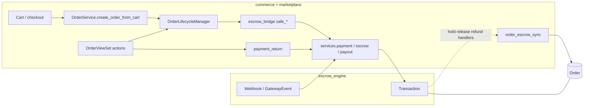

# Commerce hardening report

**Last reviewed:** 2026-04-05  
**Scope:** `commerce`, `marketplace.services` (order/stock/fee paths), `escrow_engine` (payment confirmation and verification), `commerce.services.order_escrow_sync`, `commerce.services.order_mutations`.

## What was fixed

### 1. Payment confirmation trust (critical)

- **Before:** `confirm-payment-return` trusted client-supplied `status` / `payment_status` and defaulted to `SUCCESS`, then confirmed payment — a forged client payload could mark orders paid without provider proof.
- **After:** `commerce.services.payment_return.confirm_marketplace_payment_return`:
  - Accepts only **`transaction_reference`** / **`ref`** for identification (no trust in client payment outcome).
  - Calls **`escrow_engine.services.payment.verify_payment_with_provider`** (provider API or safe engine-state short-circuit).
  - Calls **`escrow_engine.services.payment.confirm_payment`** with **`confirmation_source=PaymentConfirmationSource.PROVIDER_VERIFY`** and a **`raw_payload`** that includes **`provider_verify`** (required by escrow for this source).
  - **Idempotent return:** if the transaction is already **`HOLD`**, **`RELEASED`**, **`REFUNDED`**, or **`DISPUTED`**, it returns immediately — it does **not** call `confirm_payment` again (avoids duplicate **`PaymentRecord`** rows when buyers poll after success).
- **Escrow:** `verify_payment_with_provider`, `verify_payment_status`, `BasePaymentProvider.query_payment_status`, **`SelcomProvider.query_payment_status`** (server `POST /v1/checkout/order-status` with `vendor` + `order_id`), and **mandatory `confirmation_source`** on **`confirm_payment`** (`WEBHOOK`, `PROVIDER_VERIFY`, `ADMIN_MANUAL`, `DEV_MOCK`).

### 2. Broken / unsafe endpoints

- **`review`:** Uses **`self.get_object()`** and **`request.user`**; **`PermissionDenied` → 403**.
- **`process`:** Resolves **`EngTxn` → `Payout`**, runs **`process_payout(payout)`**, restricted to **`IsAdminUser`**, writes **`OrderAuditLog`** (`payout_process`).
- **`POST /orders/`:** **`OrderViewSet.create`** raises **`MethodNotAllowed`**; orders are created via **`cart/checkout/`** only.

### 3. Commission rule engine

- **`OrderService.calculate_platform_fee(listing, amount)`** loads active rules relevant to the listing’s category (category + global when a category exists; global-only when not).
  - Rules are ordered by **`priority DESC`**, then id.
  - At the **top priority tier**, a **category-specific** rule is preferred over a global rule when both exist (**`test_same_priority_prefers_category_rule`**).
  - If no rule matches, falls back to **`SiteConfiguration`** default percentage.

### 4. Order cancellation consistency

- **`OrderService.cancel_order`** delegates to **`OrderLifecycleManager.cancel_order`** (stock, escrow refund path, audit).
- **`auto_cancel_unpaid_order`** uses the lifecycle manager and treats **`PAID` / `HOLD` / `RELEASED` / `DISPUTED`** as paid/settled for skip logic (not only **`PAID`**).

### 5. Inventory races

- **`Listing.objects.select_for_update()`** during cart grouping, per-line checkout, and inside **`InventoryService.reserve_stock`** (wrapped in **`@transaction.atomic`**) so concurrent checkouts serialize on the listing row.

### 6. Order status mutation guards (defense in depth)

- **`OrderQuerySet.update`:** raises **`RuntimeError`** if **`status`** is in **`kwargs`** — bulk status changes must go through **`OrderLifecycleManager`** (or other approved paths), not **`QuerySet.update`**.
- **`Order.save`:** blocks **direct `status` changes** unless **`order_status_write_context(order)`** / **`allow_order_status_mutation()`** is active (used by lifecycle and **`commerce.services.order_escrow_sync`**), or **`_allow_status_mutation`** (escrow/internal).
- **`Order.clean`:** enforces allowed **state machine** transitions when status changes.
- **`PATCH /orders/{id}/`:** **Seller/admin cannot set `status`** except **buyer `cancelled`** (handled via **`OrderLifecycleManager.cancel_order`**). Other transitions must use **`ship_order`**, **`confirm_receipt`**, etc.

### 7. Escrow → order sync (commerce-owned rows)

- **`commerce.services.order_escrow_sync`:** **`sync_marketplace_order_on_escrow_hold`**, **`…_release`**, **`…_refund`** run **`Order`** updates inside **`order_status_write_context`** so **`Order.save`** guards allow escrow-driven alignment.

### 8. Admin bulk actions

- Order admin actions loop orders and call **`OrderLifecycleManager`** (`confirm_order`, `ship_order`, `confirm_receipt`, `cancel_order`) instead of raw **`queryset.update`** on **`Order.status`**.

### 9. Management command `auto_confirm_orders`

- Uses **`OrderLifecycleManager.confirm_delivery`** (delivered timestamp, delivery sync, audit) instead of raw **`Order.objects.update`**.

### 10. File upload security

- **`commerce.services.uploads`:** size and MIME checks with **`COMMERCE_UPLOAD_MAX_BYTES`** and **`COMMERCE_UPLOAD_ALLOWED_CONTENT_TYPES`** (fallback: escrow dispute limits).
- Used for **shipment** media (lifecycle) and **dispute** evidence (view).

### 11. Throttling (anti-abuse)

- Rates in **`DEFAULT_THROTTLE_RATES`:** `commerce_checkout`, `commerce_payment_initiate`, `commerce_payment_return`, `commerce_dispute`.
- Applied on **`checkout`**, **`initiate-payment`**, **`confirm-payment-return`**, **`open_dispute`**.

### 12. Audit logging and events

- **`OrderAuditLog`** (migration **`0003_orderauditlog`**) + read-only admin.
- Lifecycle and payment return (and admin payout process) write audit rows where applicable.
- **`core.events.emit_event`** used for lifecycle and payment-confirmed signals (structured logging / optional task enqueue — see **`core.events`**).

### 13. Reconciliation (operational)

- **`commerce.services.reconciliation.run_reconciliation_scan`:** scans order/transaction/reservation consistency, logs **`RECONCILIATION_*`** structured lines; optional **`auto_fix`** (see implementation).

### 14. Performance

- **`OrderSerializer`:** uses prefetched **`items`** when present.
- **`OrderViewSet`:** prefetches **`evidence`**.
- **WebSocket `order_update`:** minimal payload — **`order_id`, `status`, `buyer_id`, `seller_id`** (refetch full order via REST if needed).

### 15. Tests (see `commerce/tests/test_hardening.py`)

- Payment return / provider verification / **`confirm_payment`** enforcement for **`PROVIDER_VERIFY`** payload.
- Bulk **`Order.objects.update(status=…)`** forbidden; direct **`order.status` + save** forbidden without guard.
- Cancellation → audit; commission (category + same-priority tie-break); inventory reservation; API permissions; **`confirm_delivery`**; reconciliation scan smoke.

- **`escrow_engine/tests/test_verify_payment_provider.py`:** provider query vs short-circuit on settled states.

## What changed (API / client notes)

- **`confirm-payment-return`:** Only **`transaction_reference`** / **`ref`** is meaningful for correlation; **do not** rely on **`status`** from the client. Safe to **poll** after success: once the engine is **`HOLD`**, responses are idempotent without duplicating payment records.
- **WebSocket `order_update`:** Payload is minimal; load full order via **`GET /api/v1/commerce/orders/{id}/`** when needed.

## Remaining risks

1. **Selcom order-status contract:** Implementation uses **`POST /v1/checkout/order-status`** with **`vendor`** + **`order_id`** (engine reference). Align with Selcom’s current docs; mismatches produce explicit errors, not silent success.
2. **Mock / no API keys:** Provider query returns **not configured**; return-URL confirmation will not succeed until webhooks run, credentials exist, or the transaction has already reached **`HOLD`** (idempotent return then succeeds without provider).
3. **Raw SQL / non-ORM updates:** **`OrderQuerySet.update`** blocks **`status`** in Python; **`UPDATE commerce_order SET status=…`** in SQL would still bypass ORM (operational discipline / DB permissions).

---

## How `commerce` connects to `escrow_engine`

**Contract:** **`escrow_engine`** owns all **money and `Transaction` state** (strict FSM, `PaymentConfirmationSource`, webhooks, payouts, disputes). **`commerce`** owns **`Order`**, cart/checkout orchestration, fulfilment lifecycle, and stock reservations. They meet at a **single optional link:** **`Transaction.linked_order`** ↔ **`Order.engine_transaction`** (OneToOne).

| Direction | Mechanism | Code touchpoints |
|-----------|-----------|------------------|
| **Create link** | New **`Transaction`** with **`linked_order=order`** | **`marketplace.services.OrderService.create_order_from_cart`** → **`escrow_engine.services.create_transaction`** |
| **Start checkout** | Hosted payment URL | **`commerce.views`** → **`escrow_engine.services.payment.initiate_payment`**, **`sync_buyer_contact_for_checkout`** |
| **Confirm payment** | PAID → HOLD, audit source | **Webhooks** → **`handle_webhook` / `confirm_payment(WEBHOOK, …)`**; **return URL** → **`commerce.services.payment_return`** → **`verify_payment_with_provider`** → **`confirm_payment(PROVIDER_VERIFY, …)`** |
| **Lifecycle → money** | Preconditions then delegate | **`commerce.services.escrow_bridge`** (`safe_hold_funds_for_order`, `safe_release_funds_for_order`, `safe_refund_funds_for_order`) → **`escrow_engine.services.escrow`** |
| **Money → order row** | After hold / release / refund | **`escrow_engine.services.escrow`** post-handlers → **`commerce.services.order_escrow_sync`** (inside **`order_status_write_context`**) |
| **Read-only policy** | Same definition of “paid” for Celery | **`commerce.tasks`** → **`escrow_engine.services.linked_order.linked_order_has_escrow_payment_activity`** |
| **Payout** | Disburse seller | **`OrderViewSet.process`** (admin) → **`escrow_engine.services.payout.process_payout`** |
| **Disputes** | Engine dispute + evidence | **`OrderLifecycleManager.open_dispute` / `resolve_dispute`** → **`escrow_engine.services.escrow`** |
| **Observability** | Stats / WS | **`commerce.consumers`**, **`commerce.services.stats`**, **`commerce.services.reconciliation`** read **`Transaction` / `Payout`** |

**Dependency note:** `escrow_engine` **imports** `commerce.services.order_escrow_sync` from **`escrow_engine.services.escrow`** so that, after financial transitions, **order rows** update through commerce’s guarded save path. That is intentional; avoid duplicating order status writes elsewhere in the engine.

**Further reading:** `backend/escrow_engine/README.md`, `PRODUCTION_READY.md`, and `state_machine.py` (`TransactionStatus`, `PaymentConfirmationSource`).

---

## Production readiness scores (commerce vs escrow vs integrated)

Scores are **subjective but consistent** with this report and `escrow_engine` docs (idempotent webhooks, distributed locks, payout recovery, developer API key hardening, mandatory payment confirmation sources).

| Layer | Score | What it reflects |
|-------|------:|------------------|
| **`commerce` (orders, checkout orchestration, inventory, commissions)** | **8.7 / 10** | Status guards, lifecycle + bridge to escrow, throttles, audits, reconciliation scan; residual **gateway contract** and **ORM bypass** risks above. |
| **`escrow_engine` (transactions, webhooks, payouts, disputes, providers)** | **9.0 / 10** | Strong **money FSM**, **GatewayEvent** idempotency, **Redis locks**, **confirmation_source** on `confirm_payment`, payout **PROCESSING** + recovery tasks; still depends on **correct Selcom integration** and **ops** (Redis, Celery, secrets). |
| **Integrated marketplace path (checkout → payment → hold → fulfilment → release / refund)** | **8.9 / 10** | End-to-end design is **coherent**: one **`Transaction`** per order, **no client-trusted payment success**, **synced order updates** after escrow events, **shared “paid” semantics** for auto-cancel. The integrated score sits **between** the two apps and **just below** the engine alone because **failure modes span both domains** (e.g. order/transaction drift until reconciliation fixes, listing/stock edge cases). |

**Single headline number for “commerce + escrow_engine in production”:** **8.9 / 10**.
